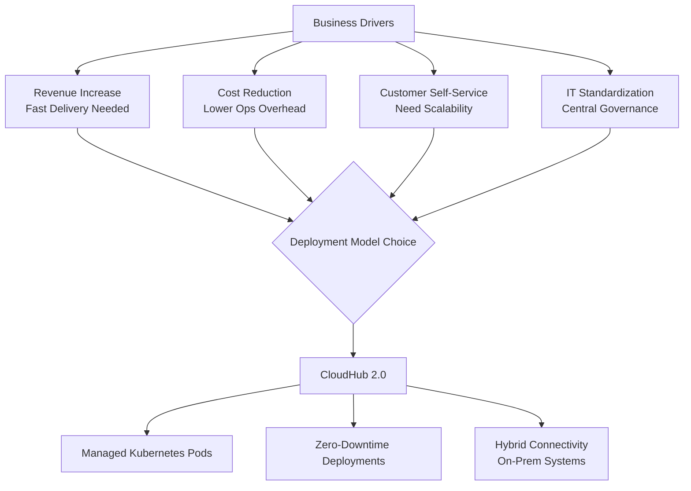

```mermaid
flowchart TD
    A[Business Drivers]-->B[Revenue Increase\nFast Delivery Needed]
    A-->C[Cost Reduction\nLower Ops Overhead]
    A-->D[Customer Self-Service\nNeed Scalability]
    A-->E[IT Standardization\nCentral Governance]

    B-->F
    C-->F
    D-->F
    E-->F

    F{Deployment Model Choice}

    F-->G[CloudHub 2.0]
    G-->H[Managed Kubernetes Pods]
    G-->I[Zero-Downtime Deployments]
    G-->J[Hybrid Connectivity\nOn-Prem Systems]
```
