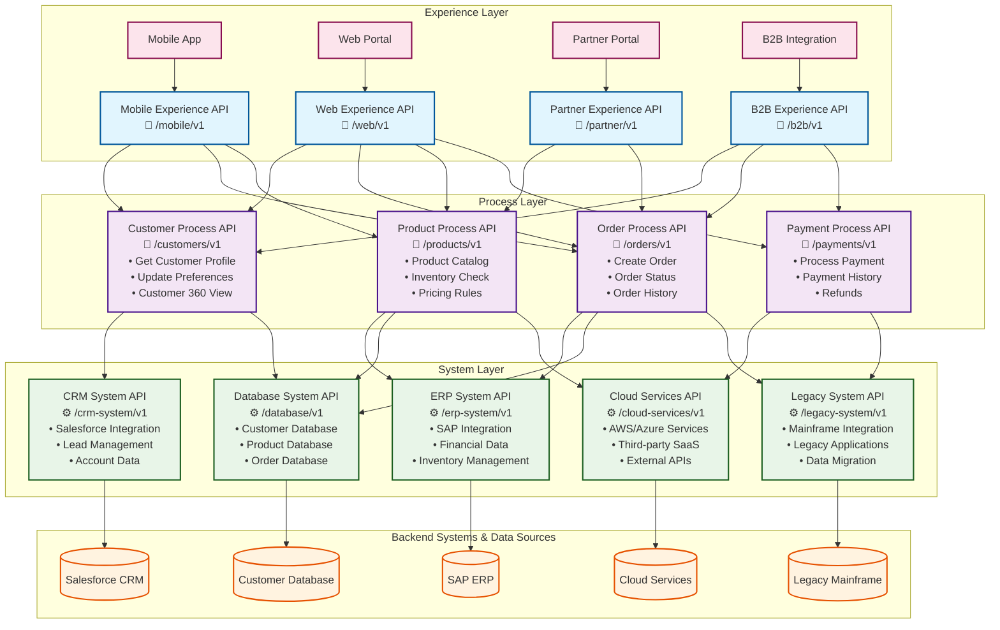

```mermaid
graph TB
    %% Experience Layer - Consumer Facing
    subgraph "Experience Layer"
        direction TB
        Mobile[Mobile App]
        Web[Web Portal]
        Partner[Partner Portal]
        B2B[B2B Integration]
        
        MobileAPI[Mobile Experience API<br/>🔌 /mobile/v1]
        WebAPI[Web Experience API<br/>🔌 /web/v1]
        PartnerAPI[Partner Experience API<br/>🔌 /partner/v1]
        B2BAPI[B2B Experience API<br/>🔌 /b2b/v1]
    end
    
    %% Process Layer - Business Logic
    subgraph "Process Layer"
        direction TB
        CustomerAPI[Customer Process API<br/>🔧 /customers/v1<br/>• Get Customer Profile<br/>• Update Preferences<br/>• Customer 360 View]
        OrderAPI[Order Process API<br/>🔧 /orders/v1<br/>• Create Order<br/>• Order Status<br/>• Order History]
        ProductAPI[Product Process API<br/>🔧 /products/v1<br/>• Product Catalog<br/>• Inventory Check<br/>• Pricing Rules]
        PaymentAPI[Payment Process API<br/>🔧 /payments/v1<br/>• Process Payment<br/>• Payment History<br/>• Refunds]
    end
    
    %% System Layer - Backend Systems
    subgraph "System Layer"
        direction TB
        CrmAPI[CRM System API<br/>⚙️ /crm-system/v1<br/>• Salesforce Integration<br/>• Lead Management<br/>• Account Data]
        ErpAPI[ERP System API<br/>⚙️ /erp-system/v1<br/>• SAP Integration<br/>• Financial Data<br/>• Inventory Management]
        DatabaseAPI[Database System API<br/>⚙️ /database/v1<br/>• Customer Database<br/>• Product Database<br/>• Order Database]
        LegacyAPI[Legacy System API<br/>⚙️ /legacy-system/v1<br/>• Mainframe Integration<br/>• Legacy Applications<br/>• Data Migration]
        CloudAPI[Cloud Services API<br/>⚙️ /cloud-services/v1<br/>• AWS/Azure Services<br/>• Third-party SaaS<br/>• External APIs]
    end
    
    %% Backend Systems
    subgraph "Backend Systems & Data Sources"
        direction LR
        CRM[(Salesforce CRM)]
        ERP[(SAP ERP)]
        DB[(Customer Database)]
        Legacy[(Legacy Mainframe)]
        Cloud[(Cloud Services)]
    end
    
    %% Connections - Experience to Process
    Mobile --> MobileAPI
    Web --> WebAPI
    Partner --> PartnerAPI
    B2B --> B2BAPI
    
    MobileAPI --> CustomerAPI
    MobileAPI --> OrderAPI
    MobileAPI --> ProductAPI
    
    WebAPI --> CustomerAPI
    WebAPI --> OrderAPI
    WebAPI --> ProductAPI
    WebAPI --> PaymentAPI
    
    PartnerAPI --> ProductAPI
    PartnerAPI --> OrderAPI
    
    B2BAPI --> CustomerAPI
    B2BAPI --> OrderAPI
    B2BAPI --> PaymentAPI
    
    %% Connections - Process to System
    CustomerAPI --> CrmAPI
    CustomerAPI --> DatabaseAPI
    
    OrderAPI --> ErpAPI
    OrderAPI --> DatabaseAPI
    OrderAPI --> LegacyAPI
    
    ProductAPI --> ErpAPI
    ProductAPI --> DatabaseAPI
    ProductAPI --> CloudAPI
    
    PaymentAPI --> CloudAPI
    PaymentAPI --> LegacyAPI
    
    %% Connections - System to Backend
    CrmAPI --> CRM
    ErpAPI --> ERP
    DatabaseAPI --> DB
    LegacyAPI --> Legacy
    CloudAPI --> Cloud
    
    %% Styling
    classDef experienceLayer fill:#e1f5fe,stroke:#01579b,stroke-width:2px
    classDef processLayer fill:#f3e5f5,stroke:#4a148c,stroke-width:2px
    classDef systemLayer fill:#e8f5e8,stroke:#1b5e20,stroke-width:2px
    classDef backendSystems fill:#fff3e0,stroke:#e65100,stroke-width:2px
    classDef consumers fill:#fce4ec,stroke:#880e4f,stroke-width:2px
    
    class Mobile,Web,Partner,B2B consumers
    class MobileAPI,WebAPI,PartnerAPI,B2BAPI experienceLayer
    class CustomerAPI,OrderAPI,ProductAPI,PaymentAPI processLayer
    class CrmAPI,ErpAPI,DatabaseAPI,LegacyAPI,CloudAPI systemLayer
    class CRM,ERP,DB,Legacy,Cloud backendSystems
```
